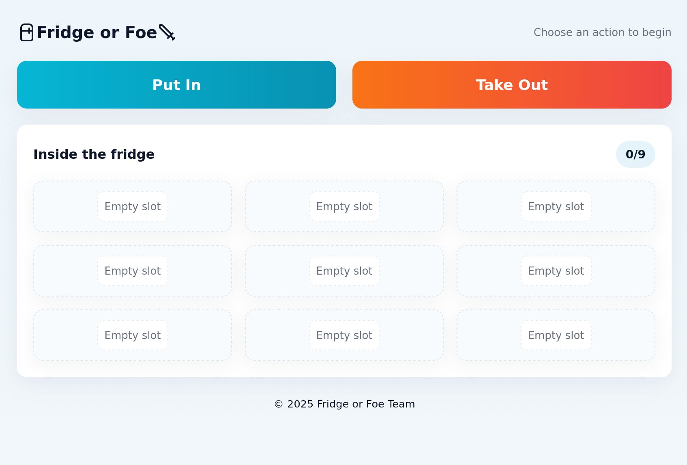

<h1 align="center">
  <a href=".">
    
  </a>
</h1>

<div align="center">
  FridgeOrFoe — a prototype smart-lock + social UX for shared fridges
  <br />
  <br />
  <a href="https://github.com/tdunc/FridgeOrFoe/issues/new?assignees=&labels=bug&template=bug_report.md&title=bug%3A+">Report a Bug</a>
  ·
  <a href="https://github.com/tdunc/FridgeOrFoe/issues/new?assignees=&labels=enhancement&template=feature_request.md&title=feat%3A+">Request a Feature</a>
  ·
  <a href="https://github.com/tristanduncombe/FridgeOrFoe/discussions">Ask a Question</a>
</div>

<div align="center">
<br />
</div>

<details open="open">
<summary>Table of Contents</summary>

- [About](#about)
- [Built With](#built-with)
- [Quick start (Docker)](#quick-start-docker)
- [API endpoints (examples)](#api-endpoints-examples)
- [Architecture & key files](#architecture--key-files)
- [Development notes](#development-notes)
- [Acknowledgements](#acknowledgements)

</details>

---

## About

Shared fridges often suffer petty food theft and low social interaction. FridgeOrFoe is a small prototype that deters casual theft and encourages playful, meaningful interactions around food. It uses a short-lived server-side unlock window and a human-pose "password" assembled from three photos.

To use the project, navigate to the (cloud deployed version)[https://fridge.tristanduncombe.com] and click "Put In". This will start your computer's camera and enable you to to take photos of your gestures. After you complete your poses, take a photo with your food, and you can put it away! If you are running a Raspberry Pi polling the backend, it will unlock (please note the development notes below)! To unlock do the three poses you 


Key behavior:
- Add an item: upload a person photo + three password photos → backend persists person image, extracts pose/hand landmarks, builds compact fingerprints and opens the lock briefly.
- Remove an item: upload three attempt photos → backend compares fingerprints and opens the lock on success.

Fingerprint logic lives in api/src/password.py.

---

### Built With

- FastAPI (backend)
- Next.js (UI)
- SQLite / local persistence (backend)
- Docker / docker-compose for orchestration

---

## Quick start (Docker)

From the repository root:

```sh
# Build and run all services (recommended)
docker compose up --build
```

Services:
- API: http://localhost:8000 — docs: http://localhost:8000/docs
- UI:  http://localhost:3000

---

## API endpoints (examples)

- Get lock state
  curl -s http://localhost:8000/lock/state | jq

- Set lock (lock)
  curl -X POST -H "Content-Type: application/json" -d '{"locked": true}' http://localhost:8000/lock/state

- Unlock for N seconds
  curl -X POST -H "Content-Type: application/json" -d '{"locked": false, "unlock_duration": 20}' http://localhost:8000/lock/state

- Add item (uploads photos and fingerprints)
  POST /inventory/items

- Attempt unlock for item
  POST /inventory/items/{id}/unlock

(See api/main.py for configurable `UNLOCK_WINDOW_SECONDS` and `UNLOCK_THRESHOLD`.)

---

## Architecture & key files

- Backend API: api/main.py  
- Vision / fingerprints: api/src/password.py — key functions: extract_body_and_hand_positions, build_fingerprint, compare_fingerprints
- UI entry: ui/app/page.tsx and CameraCapture component at ui/app/components/CameraCapture.tsx
- UI helpers & uploader: ui/app/utils/api.ts, ui/app/utils/useAuth.ts, ui/app/utils/upload.ts
- UI server proxy: ui/app/api/_backend.ts
- Pi client: client/main.py (polls /lock/state and toggles GPIO)

---

## Development notes

- UI proxies API requests via ui/app/api/_backend.ts; getApiBase (ui/app/utils/api.ts) chooses base URL.
- Password photos are processed transiently; only fingerprint vectors are stored.
- Uploaded person images persist under api/images (mapped to Docker volume api_images).
- The Raspberry Pi client only supports Raspberry Pi 5+ due to the changes to the GPIO libraries in the Pi 5.

Troubleshooting:
- If DB connection fails, inspect API container logs and docker-compose service health.
- If browser camera fails, confirm device permissions.

---

## Acknowledgements

Thanks to resources and examples used during development:
- README & template inspiration: dec0dOS amazing-github-template
- Fingerprint extraction: MediaPipe-style pose/hand landmark approaches
- Docker + FastAPI + Next.js examples
